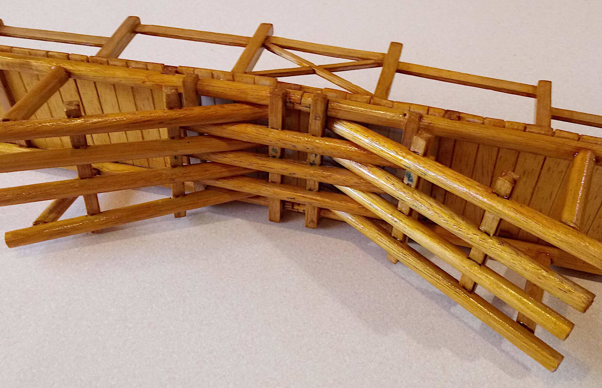

## grandpa-amus-bridge

Model of the traditional Chinese bridge constructed by Grandpa Amu

# Grandpa Amu's Bridge

I found this traditional Chinese bridge design and construction
captivating.  The interlocking pieces mean that no fasteners or glue
is required and it gets stronger under load.

[Construction video](https://www.youtube.com/watch?v=PYkgEf3eWqA) and
[more, because who can get enough](https://www.youtube.com/watch?v=iSPAK3mcI3c)

## CAD model

First I created a CAD model using
[DeclaraCAD](https://declaracad.com/).

This worked pretty well as
there are lots of repeated parts, and by using the `Cut` operation,
mortises could be automatically created in exactly the right locations
for the tenons.

[bridge.enaml source](src/bridge.enaml)

Transparency helps see the structure and joints:

I was able to export a [bridge.step](output/bridge.step) file which
could be imported into [FreeCAD](https://www.freecadweb.org/) to
generate a drawing.

[Full page drawing](output/bridge-drawing.pdf)

## Scale model

### Materials

* 8mm x 1200mm Tasmanian oak round dowel (2 pieces)
* 6mm x 6mm x 1200mm Tasmanian oak dressed all round moulding (2 pieces)
* 2.5mm x 100mm x 915mm balsa sheet (1 piece)

There wasn't much waste, probably about 20mm left from each of the
round and square dowels.  Only 1/3 of the balsa sheet was needed.

### Tools

* Craft knife
* Mini-hacksaw
* Sandpaper

### Construction

Even though I created the CAD model and drawings, construction was
done by eye, cutting with the craft knife when it would have been more
sensible to make a jig to drill out mortise holes.

Rails were created by splitting the square dowel.

### Finished model

The final model would hold together without glue, but it's a bit
fragile that way and I've spent enough time assembling it, so I glued
it with PVA craft glue.

It was then finished with a few coats of shellac.

## Next steps?

* 3D printed plastic model
* Paper model
